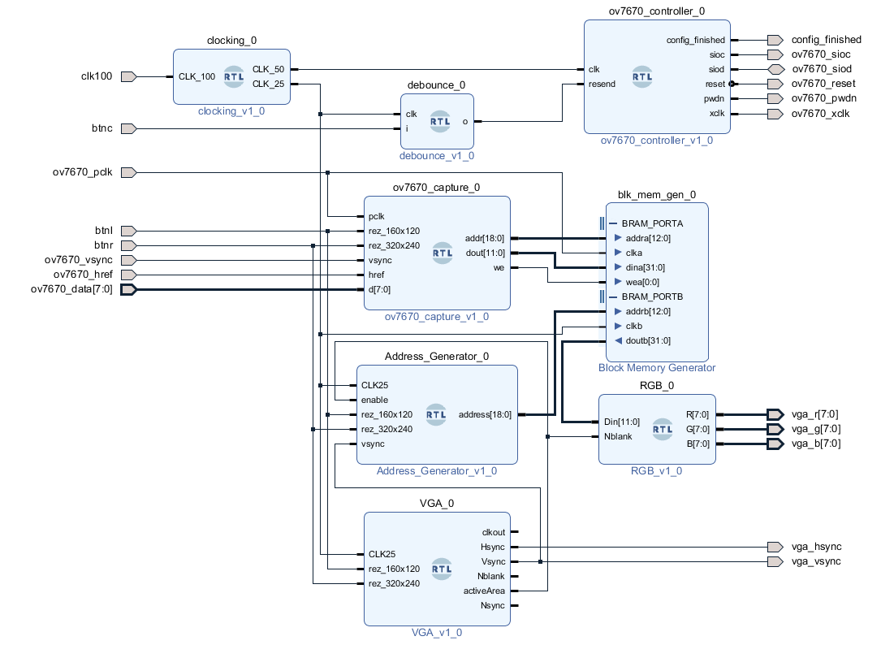

# ELE 432 Advanced Digital Design | Term Project | Image Processing: Sobel Filter | Lane Detection FPGA Project

Legal project definition:
  Sharpness and edge detection on programmable logic for real-time video stream data to be able to accelerate further image processing which will be established on SoC CPU after DMA.

Team members:

* Ertuğrul Tiyek (21828916)
* Eyüp Enes Aytaç (21828197)
* Halil İbrahim Çobanoğlu (21791747)
* Hasan Can Demir (21947157)
* Ahmet Yusuf Şirin (21947641)


This repository contains the Quartus project for lane detection using a Sobel-like filter on an FPGA, specifically implemented on the Altera DE1-SoC development board. The project utilizes an OV7670 camera for video input and incorporates FuseSoC to streamline the continuous integration and deployment (CICD) processes.

## Table of Contents

- [ELE 432 Advanced Digital Design | Term Project | Image Processing: Sobel Filter | Lane Detection FPGA Project](#ele-432-advanced-digital-design--term-project--image-processing-sobel-filter--lane-detection-fpga-project)
  - [Table of Contents](#table-of-contents)
  - [Introduction](#introduction)
  - [Project Overview](#project-overview)
  - [Project Description](#project-description)
  - [Design Approach](#design-approach)
  - [Implementation and Functionality](#implementation-and-functionality)
    - [Major Components](#major-components)
  - [HDL Architecture](#hdl-architecture)
    - [High Level Design](#high-level-design)
  - [Low Level Design](#low-level-design)
    - [Utilizing Verilog and VHDL in Project Implementation](#utilizing-verilog-and-vhdl-in-project-implementation)
    - [Top Module](#top-module)
    - [Camera Controller](#camera-controller)
    - [I2C Communication Between Camera and FPGA](#i2c-communication-between-camera-and-fpga)
    - [Camera Input Module](#camera-input-module)
    - [Address Generator](#address-generator)
    - [Thresholder](#thresholder)
    - [VGA Output Module](#vga-output-module)
  - [Results](#results)
  - [Getting Started For Contribution](#getting-started-for-contribution)
    - [Prerequisites](#prerequisites)
    - [Installation](#installation)
  - [Directory Structure](#directory-structure)
  - [Usage](#usage)
  - [Contributing](#contributing)
  - [License](#license)
  - [Conclusion](#conclusion)
  - [References](#references)

## Introduction

Lane detection is a fundamental task in computer vision, particularly for autonomous vehicles and advanced driver assistance systems (ADAS). This project focuses on implementing a Sobel-like filter on an FPGA to detect lanes in real-time. The Altera DE1-SoC development board serves as the hardware platform, while the OV7670 camera provides the video input.

To facilitate seamless integration and automation, the project incorporates FuseSoC. FuseSoC simplifies the management of IP cores and libraries, enabling an efficient and scalable development workflow. Additionally, the project leverages Git version control and GitHub tools like issues to facilitate collaboration among team members.

## Project Overview
The objective of this project is to develop a digital camera implementation using an OV7670 CMOS camera module, a VGA display, and an audio codec on a DE2-115 board using an FPGA.

## Project Description
This project involves capturing video frames from an OV7670 camera module, buffering the data on an FPGA using embedded RAM, and subsequently displaying the captured frames on a VGA monitor connected to the DE2-115 board. The clock signals required for the operation are generated inside the FPGA using ALTPLL's that take as input the 50MHz signal from the onboard oscillator.


The project also includes an audio codec component that uses the audio signals from the DE2-115 board. There are multiple clock signals associated with this audio codec and its interface with the DE2-115 board.

## Design Approach
The central component of this system is the VGA entity, which has various input and output ports. The system operates on a 25MHz clock signal and generates output signals that control the timing and synchronization of a VGA display. This includes the horizontal sync (Hsync), vertical sync (Vsync), and blanking signals (Nblank), along with an output clock signal (clkout) and an active area signal.

## Implementation and Functionality
The main functionality of the VGA system is to generate the appropriate synchronization and timing signals required to drive a VGA display. It does this by employing two key internal signals: Hcnt and Vcnt. These signals serve as horizontal and vertical counters, respectively, incrementing on each rising edge of the clock signal.

The system has constants to represent the maximum and actual screen sizes for both horizontal (HM and HD) and vertical (VM and VD) dimensions. Additionally, it contains values for front porch (HF and VF), back porch (HB and VB), and retrace (HR and VR) for both dimensions, mimicking the timing characteristics of a real VGA system.

On every clock cycle, the system increments the horizontal counter (Hcnt). When the counter reaches the maximum horizontal value (HM), it resets to zero, and the vertical counter (Vcnt) increments. Once the vertical counter reaches its maximum (VM), it too resets to zero, marking the start of a new frame.

The Hsync signal is generated by observing the value of the horizontal counter. It is set low when the counter is within the sync time period for the horizontal dimension, and high otherwise. The Vsync signal is similarly generated based on the vertical counter's value.

The blanking signal (Nblank) and the active area signal are also determined based on the counters' values. The blanking signal is active (high) when the counters' values are within the dimensions of the screen, and the active area signal indicates when the counters are within a specific area of the screen.

### Major Components

* OV7670 Camera: The camera module is interfaced with the FPGA and its control signals are generated by the ov7670_controller. The video frames are captured and buffered on the FPGA.

* VGA Monitor: The video frames stored in the buffer are displayed on the VGA monitor. The necessary control signals for the VGA monitor are generated by the VGA component in the VHDL code.

* Audio Codec: The audio signals from the DE2-115 board are used to produce audio output. The signals include audio data (AUD_ADCDAT, AUD_DACDAT), audio clock signals (AUD_ADCLRCK, AUD_BCLK, AUD_XCK, AUD_DACLRCK), and others.

* I2C: The I2C_AV_Config component interfaces with the DE2-115 board via I2C communication.

* Frequency Lookup Table: This is used to map the selected signal to a specific frequency. This could be used in generating specific audio signals corresponding to each selection.

* Clock Divider: A component named clockDivider is used to divide the original 50MHz clock to 1Hz.

* RGB Module: This module takes in the data from the frame buffer and outputs the correct RGB values for the VGA display.

## HDL Architecture

The provided VHDL code is designed with a clear and modular structure. The top-level VHDL entity (digital_cam_impl1) declares all the necessary input and output ports for the overall system, which are then interconnected with various components in the architecture. The architecture uses the structural design methodology by declaring and instantiating several components. These components perform specific functions and work together to achieve the overall functionality of the system.

### High Level Design

Since the boards are used in the laboratory until the last week, we firstly try the PoC studies on our own FPGA development boards.

Initial development was conducted on an Xilinx Basys 3 Artix-7 board. After debugging and visual adjustments were made on this platform, the project was then implemented on a DE1-SoC FPGA board.



This system is first prototyped on an Xilinx Basys 3 Artix-7 board, then implemented on a DE1-SoC FPGA board.

You can see the `Block dDiagram` in the Xilinx Vivado environment above.

## Low Level Design

### Utilizing Verilog and VHDL in Project Implementation

The implementation of this project was undertaken using both Verilog and VHDL languages to leverage the strengths and compatibility that each brings to the design flow.

Verilog, with its concise syntax and flexible coding style, enabled us to design and simulate complex digital circuits efficiently. Its C-like syntax allowed for easy coding and quick prototyping, significantly aiding the development of the more algorithmic parts of the project, such as the Sobel filter implementation.

VHDL, on the other hand, is recognized for its strong typing and rigorous syntax, which reduces the possibility of coding errors and enhances the reliability of the designed modules. The OV7670 capture module and VGA driver were implemented in VHDL due to its ability to precisely define hardware structures, which is ideal for the low-level design required in these components.

Importantly, both Verilog and VHDL are compatible with modern FPGA development tools, which allowed us to integrate the modules written in different languages seamlessly in a single project. This interoperability between Verilog and VHDL modules was achieved by using appropriate wrappers, which enabled the conversion of the signals between the different language domains.

This approach, leveraging the strengths of both hardware description languages, not only accelerated the project implementation but also ensured the robustness of the design. It made the process of debugging and integration smoother and led to a more reliable system. By choosing the best language for each task, we were able to build a complex real-time video processing system with Sobel edge detection and thresholding capabilities.

### Top Module 

This project involves capturing video frames from an OV7670 camera module, buffering the data on an FPGA using embedded RAM, and subsequently displaying the captured frames on a VGA monitor connected to the DE2-115 board. The clock signals required for the operation are generated inside the FPGA using ALTPLL's that take as input the 50MHz signal from the onboard oscillator.

The project also includes an audio codec component that uses the audio signals from the DE2-115 board. There are multiple clock signals associated with this audio codec and its interface with the DE2-115 board.


We us a PLL logic circuit to obtain required 50 and 25 MHz clocks from 100 MHz motherboard integreted circuit.


### Camera Controller

The communication between the OV7670 camera and FPGA is established using the I2C (Inter-Integrated Circuit) protocol, which is a widely used protocol in embedded systems for short distance, low-speed communications. I2C uses only two bidirectional open-drain lines, Serial Data Line (SDA) and Serial Clock Line (SCL), pulled up with resistors. In this project, the I2C protocol is used to configure the OV7670 camera's registers and control its operations.


### I2C Communication Between Camera and FPGA

The FPGA acts as the master device initiating the communication, while the OV7670 camera serves as the slave device. The communication begins with the FPGA sending a START condition on the I2C bus, followed by the camera's 7-bit address and a bit indicating whether the master wishes to write to or read from the slave. Upon receiving its address, the camera sends an ACK (acknowledgement) signal back to the FPGA.


In write mode, the FPGA sends a byte of data (representing the register address) to the camera, followed by the data to be written to that register. The camera acknowledges receipt of each byte. In read mode, the process is similar, but the FPGA reads the register data sent by the camera.


In this project, the I2C communication is crucial for configuring the OV7670 camera settings, such as setting image quality, brightness, contrast, and color saturation. It also enables the FPGA to control advanced camera features like automatic exposure control, gamma correction, white balance, and more.


In conclusion, the I2C protocol provides a flexible and efficient means of communication between the FPGA and OV7670 camera, enabling fine-grained control of the camera's operation and resulting image capture quality.

### Camera Input Module
The OV7670_capture entity captures pixel data from each frame of the OV7670 camera and stores them in block RAM. It employs internal signals and processes to handle synchronization, data latching, and write control.

The pixels are captured based on the state of the href signal, which controls how often pixel data are captured. For every four href cycles, one pixel is captured. An additional control signal, 'line', regulates the frequency of data capture, in this case, capturing data every fourth line.

### Address Generator

The system implemented the address generation process which gets activated when the Nblank signal is '1' (indicating an active display area). This process increments an internal address counter (val) with each rising edge of the CLK25 clock signal, to keep track of the pixel data read from the input Din.


The RGB signals for the pixels were generated by dividing the 12-bit input into three 4-bit segments representing red, green, and blue. Each segment was replicated to generate 8-bit output signals. This operation was activated only when Nblank was '1'.

The code also provided an LED output. It handled specific conditions where all the RGB signals were high, indicating a bright pixel. The LED signal was manipulated based on the status of the RGB signals.

A filter was implemented which would pass the 8-bit RGB signals to the output only if the filterIn signal was '1'. If it wasn't, the unaltered 4-bit RGB values from the input Din would be passed to the output instead.


### Thresholder


### VGA Output Module

VHDL code provided a basic yet comprehensive system to handle RGB signal generation and management for a 320x240 display system. It demonstrated good use of signal manipulation, clock synchronization, and filter application in VHDL. Future enhancements to this project could include the addition of more sophisticated filters, support for different display resolutions, and improved LED control schemes.


## Results


<!--  -->


<!--  -->
<!--  -->

<!--  -->

<!--  -->


## Getting Started For Contribution

To get started with the project, follow the instructions below.

### Prerequisites

- Quartus Prime software (version X.X or later): [Download](https://www.intel.com/content/www/us/en/software/programmable/quartus-prime/overview.html)
- DE1-SoC Board Support Package (BSP): [Download](https://www.terasic.com.tw/cgi-bin/page/archive.pl?Language=English&No=836)
- Git version control system: [Download](https://git-scm.com/downloads)
- FuseSoC: [Installation Guide](https://github.com/olofk/fusesoc)

### Installation

1. Clone the repository:

```bash
git clone https://github.com/ayusufsirin/ele432_project/
```

2. Install Quartus Prime software according to the instructions provided by Intel.

3. Download and install the DE1-SoC BSP package from the Terasic website.

4. Install Git and configure your global settings (if not already done).

5. Install FuseSoC by following the installation guide provided in the FuseSoC repository.


## Directory Structure

The workspace for this project follows the following directory structure:

- **workspace:** This directory contains the compiled project files for Quartus, including the generated output files, such as the programming files and project configuration files.

- **hdl:** The `hdl` directory contains the generic IP core files. These files define the hardware design components used in the project, such as modules, interfaces, and entities.

- **ip:** The `ip` directory contains the IP cores specifically developed for Quartus. These cores are reusable hardware components that can be integrated into the project design. Examples of IP cores include processors, memory modules, and communication interfaces.

- **report:** The `report` directory contains the project report, which provides detailed information about the design, implementation, and results of the lane detection FPGA project. It may include performance analysis, optimization strategies, and other relevant documentation.

Please refer to the specific directories for more details on their contents and organization. Ensure that you maintain the directory structure when working with the project to ensure proper file references and ease of navigation.


## Usage

1. Connect the Altera DE1-SoC development board to your computer.

2. Open the Quartus Prime software and load the Quartus project file (`digital_cam_impl1.qpf`) located in the project sub-directory `workspace`.

3. Configure the project settings as needed.

4. Build the project by selecting the appropriate build configuration and clicking on the "Start Compilation" button.

5. Once the compilation is complete, program the FPGA using Quartus Prime.

6. Connect the OV7670 camera to the appropriate interface on the DE1-SoC board.

7. Power on the board and execute the lane detection application.

8. Monitor the output on the display or via the UART interface, as specified in your design.

For more detailed information or troubleshooting, refer to the project documentation.

## Contributing

Contributions to this project are welcome. To contribute, please follow these steps:

1. Fork the repository.

2. Create a new branch for your feature or bug fix.

3. Make the necessary changes in your branch.

4. Test your changes thoroughly.

5. Commit your changes and push the branch to your fork.

6. Submit a pull request to the main repository.

Please ensure that your contributions adhere to the coding standards, and include appropriate documentation where necessary.

## License

This project is licensed under the [MIT License](LICENSE). You are free to modify, distribute, and use the code in this project for personal or commercial purposes. See the [LICENSE](LICENSE) file for more details.

## Conclusion
The designed digital camera implementation is a complex and versatile system. By efficiently interfacing a CMOS camera module and a VGA display, it provides a tangible platform for capturing and displaying video frames. Moreover, the inclusion of an audio codec adds an extra dimension to this design, making it a multimedia platform. The provided VHDL code showcases a high level of detail and understanding of FPGA design principles and would serve as a solid basis for similar projects in the future.

## References

[1] Reference Sobel filter repo: https://github.com/Marco-Winzker/FPGA-Vision

[2] Reference Sobel filter video: https://youtube.com/playlist?list=PLGzeDuLmmxDq5ErLABOdJkdFO3imtwUqJ

[3] Reference camera to VGA demo project: https://www.fpga4student.com/2018/08/basys-3-fpga-ov7670-camera.html